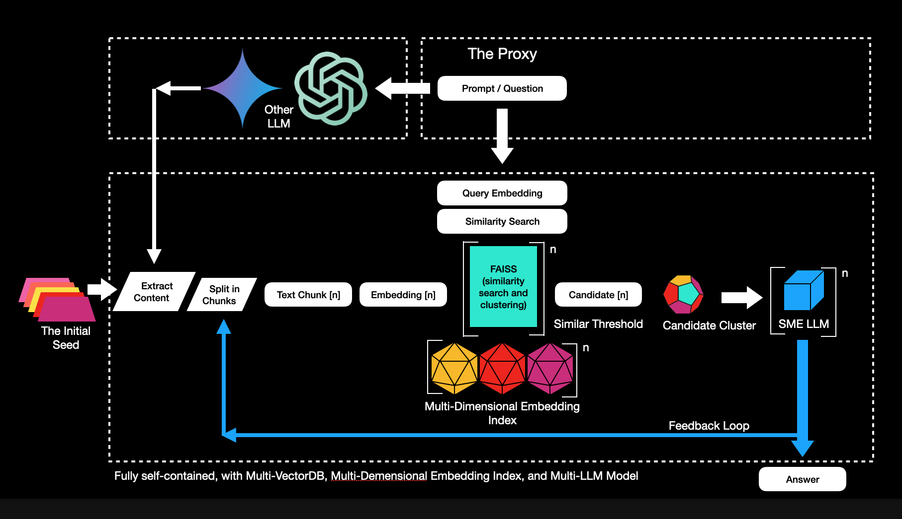
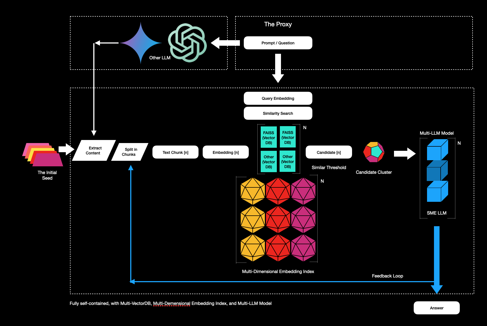
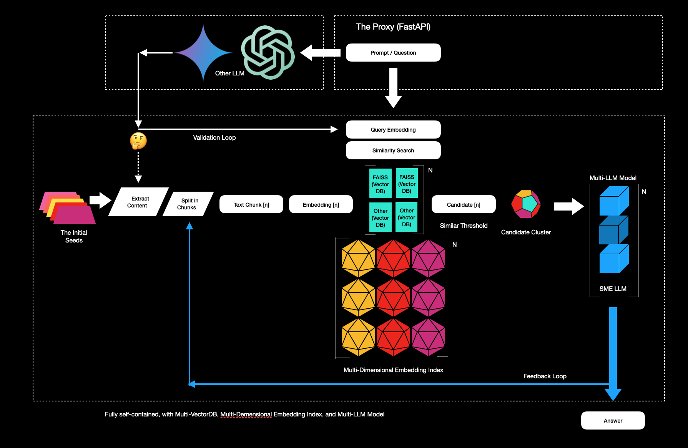
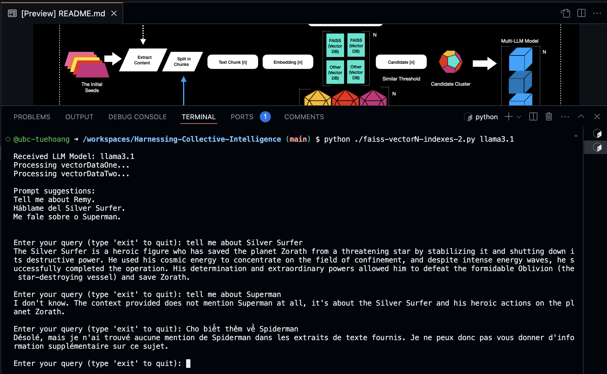

# Harnessing Collective Intelligence

- Dare to Dream
- Inspire Bold Leadership
- Embrace Diversity in Thought and Innovation
- Explore together & unlock the world's knowledge

------------------------------

## Integrating Multi-VectorDB and Multi-LLM Models for Evolving Data Insights

This section explores the concept of collective intelligence, where the combined knowledge and insights from diverse sources are integrated into a single system. The focus is on using advanced technologies like Multi-VectorDB and Multi-Dimensional Embedding Indexes to manage and process complex, multi-dimensional data efficiently. By leveraging Multi-LLM Model (Large Language Models), the system analyzes this integrated data, extracting deeper insights and demonstrating the importance of inclusivity in building adaptable and intelligent systems.

This focuses on vectors as the core language through which machines process and understand data. By employing Multi-VectorDB, the system can store and manage vectors that represent complex, multi-dimensional data. The section highlights the transformation of raw datasets into multi-dimensional vectors, which are then used for tasks like similarity searches. Multi-LLM Model further enhance this process by offering diverse insights, demonstrating how vectors serve as a foundational tool in machine learning.

By using Multi-VectorDB and Multi-Dimensional Embedding Indexes, the system integrates a diverse range of data sources, ensuring that multiple perspectives are included. Multi-LLM Model evaluates the impact of this inclusivity, demonstrating that integrating diverse knowledge is essential for the continuous development and effectiveness of collective intelligence. This section argues that inclusivity is a critical aspect of technological progress, ensuring that the system evolves in a way that reflects the complexity of human knowledge.

Conclusion: The idea proposes that the future of technology lies in its ability to assimilate knowledge inclusively, transcending the limitations of individual components to create a new form of collective intelligence. This new form of intelligence could pave the way for a deeper, more integrated understanding of consciousness itself.

Keywords: Collective Intelligence, Vectors, VectorDB, Consciousness, Artificial Intelligence, RAG, ANN, Inclusivity, Machine Learning, Data Assimilation, Borg.

--------------------

## on Github Codespaces with 16-core

